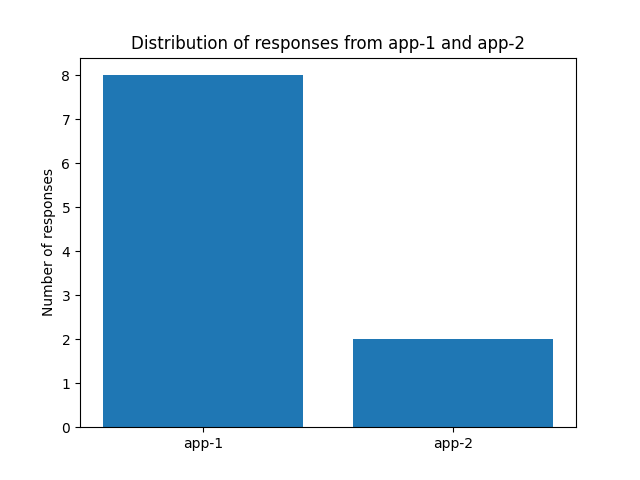

# Assignment 3 File Submission Breakdown

This readme provides a description of the steps and outputs that meet the requirements provided for the assignment. To start you run  `minikube start` which is followed by `minikube addons enable ingress` to ensure the addon ingress-controller is working. Then, you apply the files (just incase they have changed) by running the command:

` kubectl apply -f app-1-dep.yaml -f app-1-svc.yaml -f app-2-dep.yaml -f app-2-svc.yaml -f nginx-dep.yaml -f nginx-svc.yaml -f nginx-configmap.yaml -f nginx-ingress.yaml -f app-1-ingress.yaml -f app-2-ingress.yaml`

This ensures all config files are up to date.

## NGINX Deployment (10%)

`nginx-dep.yaml` defines a Deployment for an NGINX server. It creates 5 replicas of the NGINX pod, each running the base image of `nginx:1.14.2` image and listening on port 80.

## NGINX ConfigMap (10%)

`nginx-configmap.yaml` defines a ConfigMap that stores the configuration files for the NGINX server under the key `default.conf`. The ConfigMap is mounted as a volume in the NGINX pods.

## NGINX Service (10%)

`nginx-svc.yaml` defines a Service that exposes the NGINX Deployment within the cluster (using type: `ClusterIP`) on port 80, selecting the pods from the deployment step using specified labels.

## NGINX Ingress (20%)

`nginx-ingress.yaml` defines an Ingress that routes external HTTP traffic to the NGINX Service. This originally loadBalances incoming requests in the prefix path `/` to the backend service defined in `nginx-svc.yaml`.

## App-1 and App-2 Deployments and Services (15%)

`app-1-dep.yaml`, `app-1-svc.yaml`, `app-2-dep.yaml`, and `app-2-svc.yaml` define Deployments and Services for the two sample applications. Each Deployment creates a pod running a specific version of the sample app, and each Service exposes its respective app within the cluster.

## App-1 and App-2 Ingresses (20%)

`app-1-ingress.yaml` and `app-2-ingress.yaml` define Ingresses that route external HTTP traffic to the Services for app-1 and app-2, respectively. They also configurre canary deployment, directing approximately 70% of traffic to app-1 and 30% to app-2. To test the setup, I sent 10 HTTP requests using Python and observed the responses from the load-balanced backends. Since the distribution of requests to app-1 and app-2 is probabilistic, a large amount of requests would help better see the distribution. But for our small testing purposes we can see the loadBalancing is working by sending 10 curl requests, the LoadBalancer still favours App-1 while also sending requests to App-2 at a smaller percentage (80-20 split). To fully see the 70-30 split, we can follow the law of large numbers, which suggests that with a larger number of requests, the distribution should get closer to the 70-30 split.

### Request Distribution

